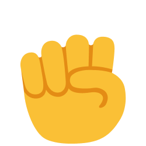
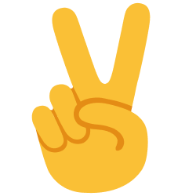

Hi, I'm Carl Amiel Balita, a Junior Web Developer. This is my first project from re/learning JavaScript (FreeCodeCamp + [SuperSimpleDev](https://www.youtube.com/c/SuperSimpleDev) and other YouTubers). Hoping to build more projects, advance in tech, and learn React + more languages soon. Thank you!\n\n\n# 🎮 Rock Paper Scissors

A simple, fun Rock-Paper-Scissors game built with vanilla HTML, CSS, and JavaScript. Play against the computer, track your wins/losses/ties with persistent scoring, and enjoy smooth hover animations!

  

## 🕹️ Features
- **Play Rock, Paper, or Scissors** using emoji buttons.
- **Real-time results** with computer move visualization.
- **Persistent score** saved in browser's localStorage (wins, losses, ties).
- **Reset score** button to start fresh.
- **Responsive design** with dark theme, hover effects, and mobile-friendly layout.
- **No dependencies** – runs instantly in any modern browser.

## 🚀 How to Play
1. Click one of the three buttons: 🪨 **Rock**, 📄 **Paper**, ✂️ **Scissors**.
2. See the result, your move vs. computer's random move.
3. Win (+1 win), Lose (+1 loss), or Tie (+1 tie).
4. Score auto-saves; reset anytime.

## 📱 How to Run
1. Open `index.html` in your web browser (double-click or drag to browser).
2. Or in terminal: `start index.html` (Windows).
3. Play immediately – no setup required!

Demo score display:
```
Wins: 5, Loses: 3, Ties: 2
```

## 🛠️ Tech Stack
| File | Purpose |
|------|---------|
| `index.html` | Game structure, buttons, result/score display |
| `style.css` | Dark theme, flexbox centering, button hovers (scale + glow) |
| `script.js` | Game logic, computer AI (random), localStorage, DOM updates |
| `assets/images/` | Emoji icons for Rock 🪨, Paper 📄, Scissors ✂️ |

## 🔧 Local Development
- Edit files directly.
- Refresh browser to test changes.
- Scores persist across sessions (clear browser data or use reset to wipe).

## 🙏 Acknowledgments
Special thanks to **[SuperSimpleDev](https://www.youtube.com/c/SuperSimpleDev)** for the excellent JavaScript tutorial that inspired this project! This was my first project while re/learning JavaScript. Looking forward to doing more projects and learning more.

## 📄 License
MIT License – feel free to use, modify, and distribute.

---

**Made with ❤️ for JavaScript restudy. Play now: [Open index.html](file:///c:/CODE-PROJ/Rock-Paper-Sci/index.html)**

⭐ Star if you enjoy!

